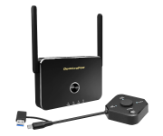
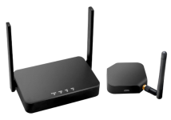
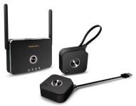
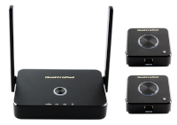
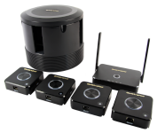

# QuattroPod Series

QuattroPod Series is a presentation system primarily designed for conference rooms for wirelessly mirroring screen content to a screen or projector. And all this without any software or app!

The QuattroPod series comes in a variety of models: 

	
	

		
		
QuattroPod USB is the latest model in the series and consists of a USB transmitter and a standard receiver. The transmitter enables screen transmission in up to Full HD with just one USB cable. No matter what connections your computer has, you can manage with this one-cable solution. The receiver supports all functions and transmitters (*except QuattroPod Lite) of the previous models in up to Ultra HD (4K).

		
<a href="usb/intro">View QuattroPod USB</a>

	

	
	

		
		
The QuattroPod Lite package consists of a Lite transmitter and a Lite receiver. The receiver connects to a screen or projector via HDMI. You can then mirror your screen content using either by connecting the Lite transmitter to your notebook or MacBook via HDMI or mirror your device's screen wirelessly via AirPlay for iOS/macOS, Google Cast via the Chrome browser or the QuattroPod app for Android. The QuattroPod Lite will be integrated into your network via Wi-Fi. It is equipped with a mounting option via VESA and supports Touch Back functionality from your display.

		
<a href="lite/intro">View QuattroPod Lite</a>

	

	
	

		
		
The QuattroPod Mini package consists of two mini transmitters and a standard receiver. The standard receiver has all the basic features of the Lite receiver and much more. Network connectivity includes Wi-Fi or network cable (PoE). Cast your smartphones, tablets and notebooks in up to Full HD via the USB or HDMI port of the transmitters. Control the flow of the presentation at the touch of a button using the controls  on the transmitter. The Multicast function allows you to transmit screen contents of one device to several displays simultaneously with the help of a paired transmitter.

		
<a href="mini/intro">View QuattroPod Mini</a>

	

	
	

		
		
The QuattroPod Standard package includes two standard transmitters and one standard receiver. Virtually any type of enddevice can be mirrored in up to Ultra HD (4K) via the USB, HDMI or Mini DisplayPort transmitter connections. The transmitters also support LAN (PoE) cable connections.

		
<a href="standard/intro">View QuattroPod Standard</a>

	

	
	

		
		
The QuattroPod Deluxe package consists of four standard transmitters, a standard receiver and a tray which can store up to four transmitters. Our most comprehensive solution for professional conference rooms.

		
<a href="deluxe/intro">View QuattroPod Deluxe</a>

	

Choosing Your Solution:

!!! tip "QuattroPod Comparison Table"

    [![QuattroPod][1]{: align=left }][2] Not sure yet what device is the right one for you? 
	Our **Product Comparison** of the **QuattroPod Series** will help you decide.
	
	[View Product Comparison (PDF)][2]

  [1]: assets/img/quattropod.productcomparison.en.png
  [2]: https://download.stueber.de/doc/en/quattropod/quattropod.productcomparison.en.pdf